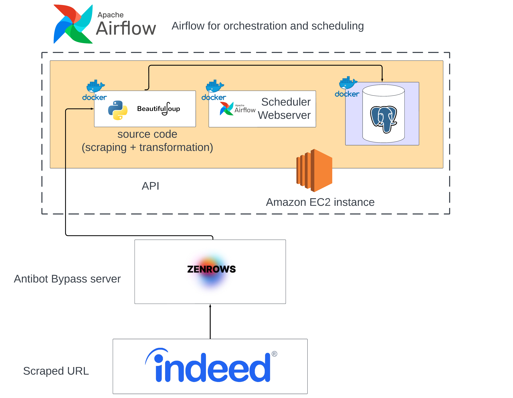
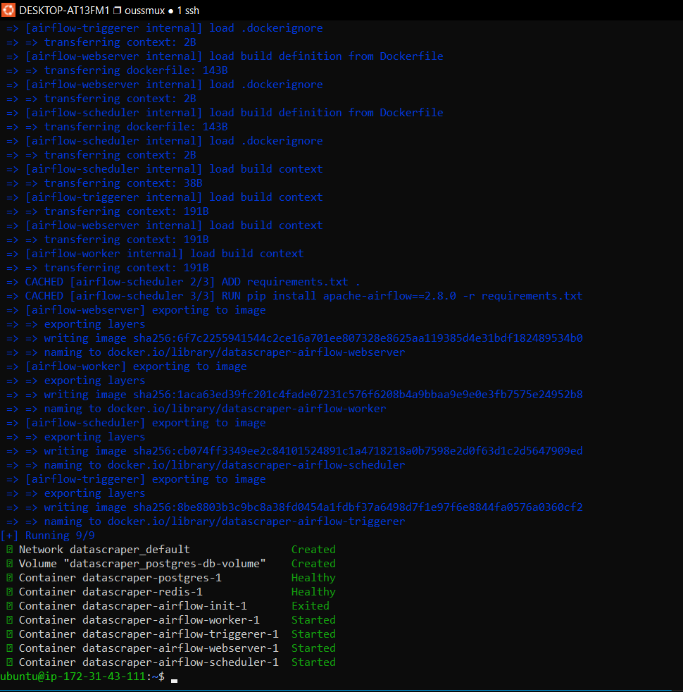

# Indeed Web Scraper


# Overview

This is a web scraper designed for Indeed job listings, utilizing a paid web proxy API for efficient scraping. The application can be deployed using Docker Compose, extracting job information based on specified subjects and job freshness criteria and storing it in a PostgreSQL database.

## Why Use This Scraper?
Unlock a multitude of options in your job search with this web scraper. Here are some of the possibilities it offers:

### Job Market Insights
Analyze the job market tailored to your specific skills and target career. Gain powerful insights into market trends, skill demands, and company preferences.

### Personalized Job Search
Customize your job search to match your preferences by filtering based on technologies, skills, and languages. Enjoy a personalized job-hunting experience.

### Targeted Company Exploration
Zero in on opportunities aligned with your career goals by filtering job listings based on companies of interest.

### Automated Applications
Experience the convenience of automating job applications, streamlining the process for increased efficiency.


# Example Deployment on EC2 Ubuntu Instance



## Requirements

- Ensure your instance has sufficient compute resources (2vCPUs and 8GB RAM recommended).
- Allow inbound connections on port 8080 (Airflow web server) and port 5432 (PostgreSQL).
- Set up an `init_instance.sh` file, then execute it to start all containers.

## Initialization Script

```bash
# Install Docker
sudo apt update

# Clone the code and create an .env file
git clone https://github.com/Booss3my/Datascraper.git
echo -e "AIRFLOW_UID=$(id -u)\n
AIRFLOW_GID=0\n
antibotbypass_API_KEY=0000this0is0a0fake0key0000\n
DB_USER=airflow\n
DB_PASS=airflow \n
DB_HOST=localhost\n
DB_NAME=indeed_scrape" > Datascraper/.env
cd Datascraper
sh build.sh
```
It should look something like this:




## Troubleshooting
If airflow-init breaks due to the absence of the "airflow" database in the PostgreSQL container:

Enter the PostgreSQL container:

```bash
Copy code
docker exec -it datascraper_postgres_1 bash
```
Create the database:

```bash
Copy code
createdb -h localhost -U airflow airflow
```

Exit the container (Ctrl+D) and ensure you're in the root folder.

Rerun the build script:

```bash
sh build.sh
```
