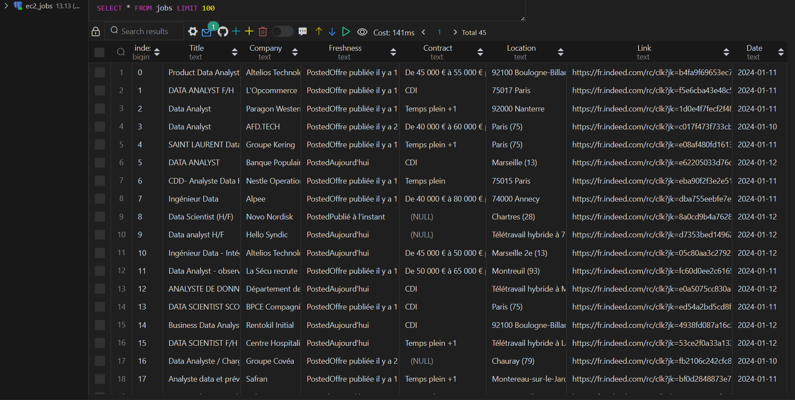

# Indeed web scraper
This is an indeed webscraper using a paid webproxy API for scraping (used to work with free ones see scrape_proxies.py) can be depolyed using docker-compose, scrapes jobs off indeed given a subjects and job freshness args and stores then a jobs table in postgres.


# Example using an EC2 Ubuntu instance


- Make sure your instance has sufficient compute (2vcpus and 8Gb Ram is more than enough) 
- Make sure you allow inboud connections on port 8080 for the (airflow webserver) and 5432 for postgres.
- Set up a init_instance.sh file, then run it, and it should start all containers:

```bash
sudo apt update

#installing docker

sudo apt install -y apt-transport-https ca-certificates curl software-properties-common

curl -fsSL https://download.docker.com/linux/ubuntu/gpg | sudo gpg --dearmor -o /usr/share/keyrings/docker-archive-keyring.gpg

echo "deb [arch=amd64 signed-by=/usr/share/keyrings/docker-archive-keyring.gpg] https://download.docker.com/linux/ubuntu $(lsb_release -cs) stable" | sudo tee /etc/apt/sources.list.d/docker.list > /dev/null

sudo apt update

sudo apt install -y docker-ce docker-ce-cli containerd.io

sudo systemctl start docker

# installing docker-compose

sudo curl -L https://github.com/docker/compose/releases/latest/download/docker-compose-$(uname -s)-$(uname -m) -o /usr/local/bin/docker-compose

sudo chmod +x /usr/local/bin/docker-compose

# cloning code and creating an .env file (make sure to fill in your API_key)

git clone https://github.com/Booss3my/Datascraper.git

echo -e "AIRFLOW_UID=$(id -u)\n
AIRFLOW_GID=0\n
antibotbypass_API_KEY=0000this0is0a0fake0key0000\n
DB_USER=airflow\n
DB_PASS=airflow \n
DB_HOST=localhost\n
DB_NAME=indeed_scrape" > Datascraper/.env

cd Datascraper

sh build.sh
```

It should look something like this:


# Why not search directly on indeed ? 




More flexibilty and more options:
- Search by technology, skill, language.
- Filter results by companies of interest.
- Possibility of also automating the application process.

# Troubleshoosting

If airflow-init breaks due to no database "airflow" in the postgres container, you can go in the postgres container and create the database then rerun the build file:
```
exec -it datascraper_postgres_1 bash
```
```
createdb -h localhost -U airflow airflow
```
// exit the container (Ctrl+D)
// Make sure you're in the root folder
```
sh build.sh
```
